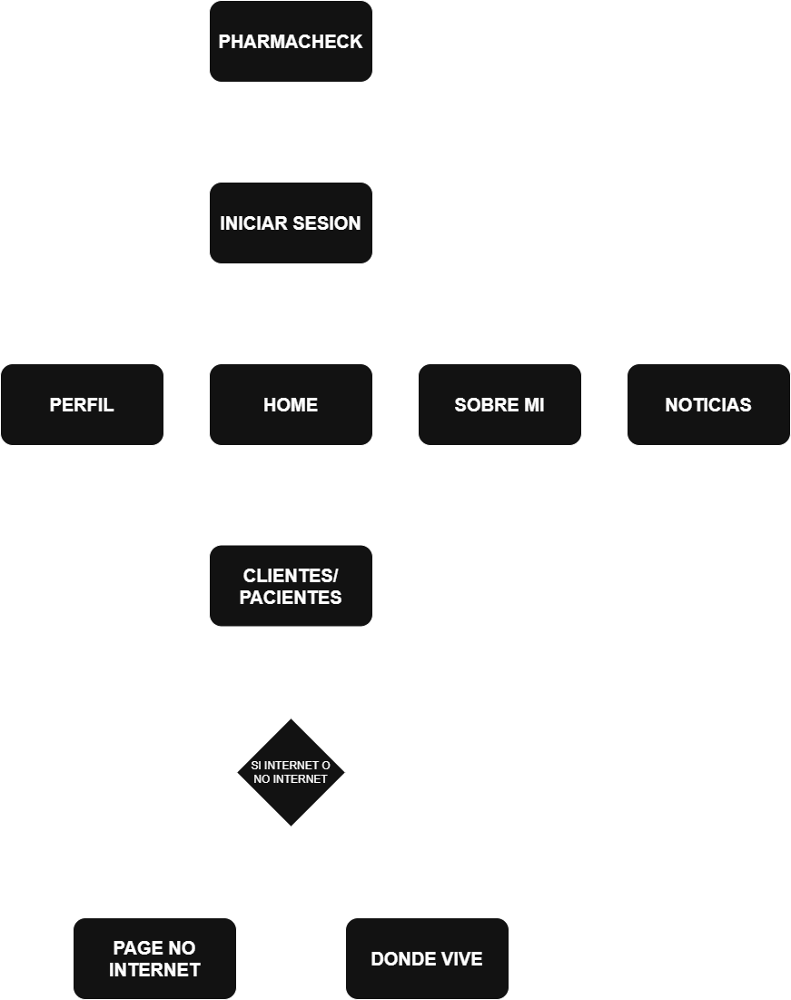

# PharmaCheck - Gestión de Medicamentos para Atención Domiciliaria

## Descripción del Proyecto

PharmaCheck es una aplicación móvil desarrollada con Flutter diseñada para optimizar el trabajo de enfermeros y profesionales de la salud que realizan atención domiciliaria. Su objetivo principal es:

- Registro confiable de la administración de medicamentos a pacientes.
- Mejorar la trazabilidad de tratamientos médicos.
- Reducir errores en la gestión de medicamentos.
- Visualización clara del estado de cada paciente.

La aplicación combina funcionalidades clave con una interfaz amigable y adaptable a diferentes dispositivos.

## Funcionalidades Principales

### 1. Gestión de Pacientes

- Lista organizada de pacientes con filtros (Todos, Críticos, Listos).
- Añadir nuevos pacientes con foto y datos personales.
- Editar o eliminar pacientes existentes.
- Sistema de colores para identificar pacientes críticos (rojo) y aquellos que ya tomaron sus medicamentos (verde).

### 2. Administración de Medicamentos

- Registro de remedios por paciente con horarios específicos.
- Marcar medicamentos como administrados.
- Orden inteligente de medicamentos según proximidad horaria.
- Edición o eliminación de remedios.

### 3. Mapa Integrado

- Visualización de la ubicación aproximada de pacientes.
- Edición manual de direcciones.

### 4. Perfil de Usuario

- Edición de datos personales (nombre, correo, teléfono, fecha de nacimiento).
- Cambio de foto de perfil (desde galería o cámara).

### 5. Noticias Relevantes

- Sección con información útil sobre descuentos en farmacias, campañas de vacunación, entre otros.

### 6. Sistema de Feedback

- Valoración por categorías (usabilidad, diseño, rendimiento).
- Envío de comentarios directamente al desarrollador.

### 7. Personalización

- Modo claro/oscuro o ajuste automático según sistema.
- Tamaños de elementos ajustables (pequeño/mediano).

## Diagrama de la Aplicación

A continuación, se muestra el diagrama general del funcionamiento de la app:

## Enlaces Relevantes
- **Repositorio GitHub:** [Acceder al Código](https://github.com/JoseHernandezVera/pharmacheck_app.git)

## Tecnologías Utilizadas

- Flutter (Framework multiplataforma)
- Sqflite (Autenticación y base de datos, si aplica)
- Google Maps API (Integración de mapas)
- Provider (Gestión de estado)
- SharedPreferences (Almacenamiento local)

## Autor

José Fernando Hernández Vera  
RUT: 21.370.316-1  
